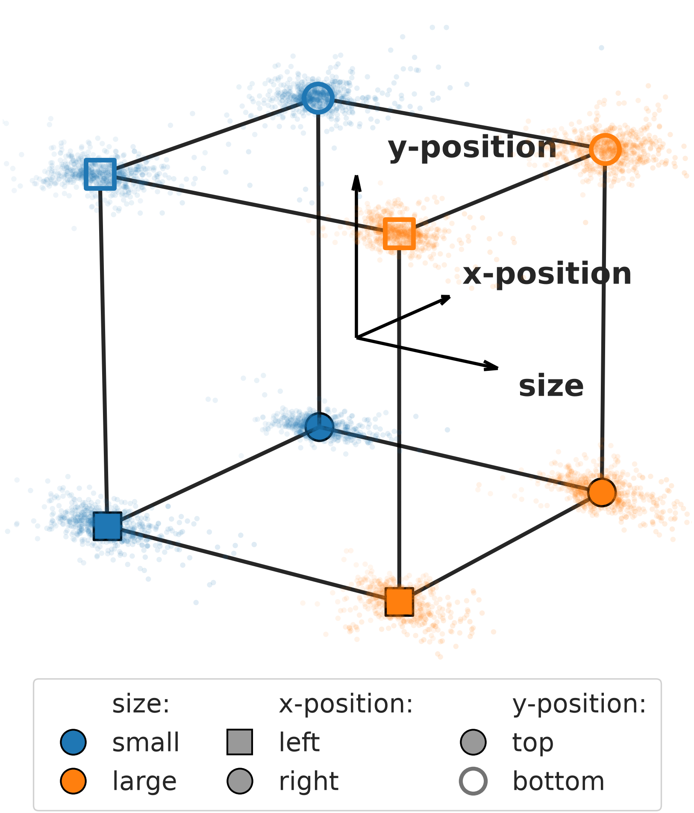
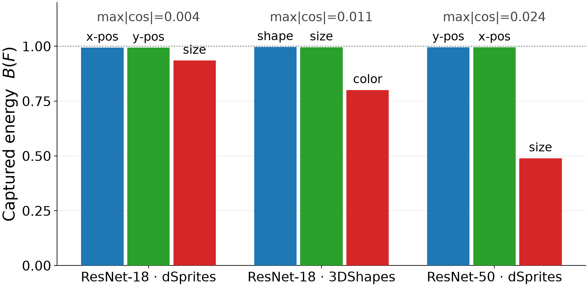
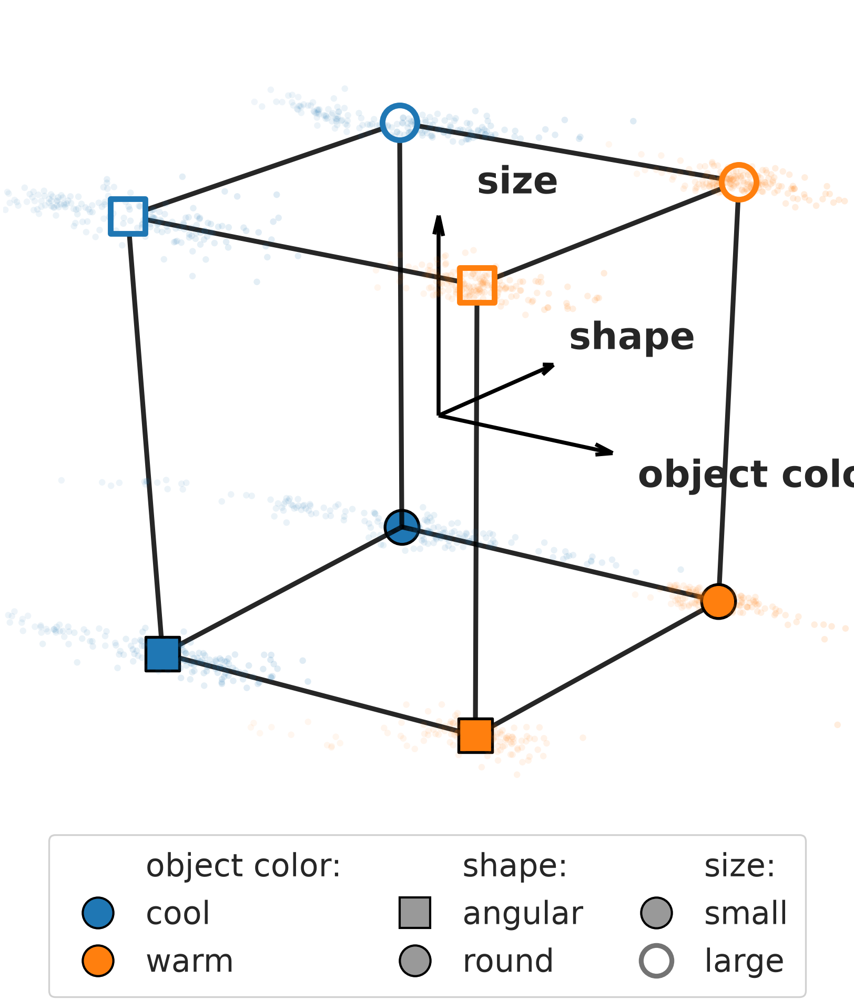
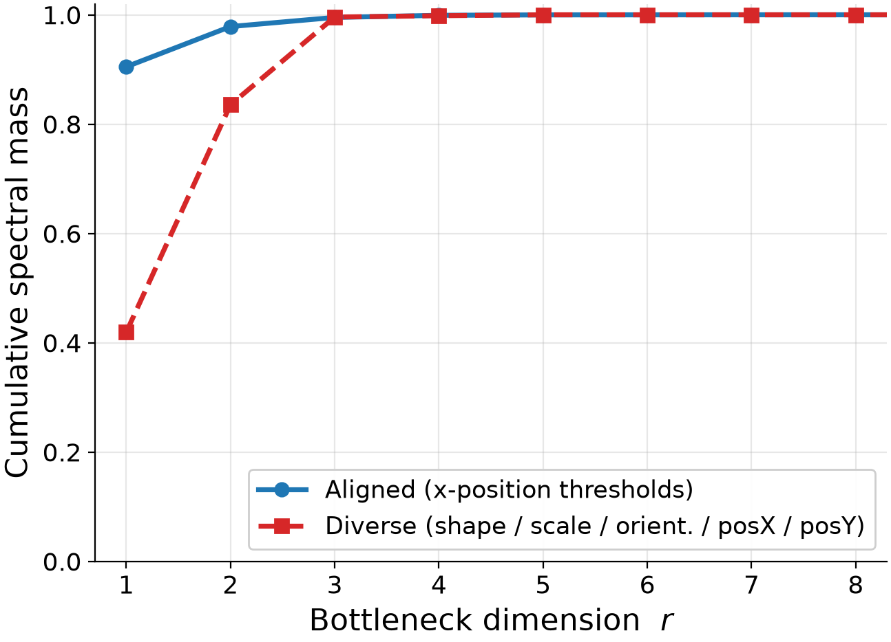
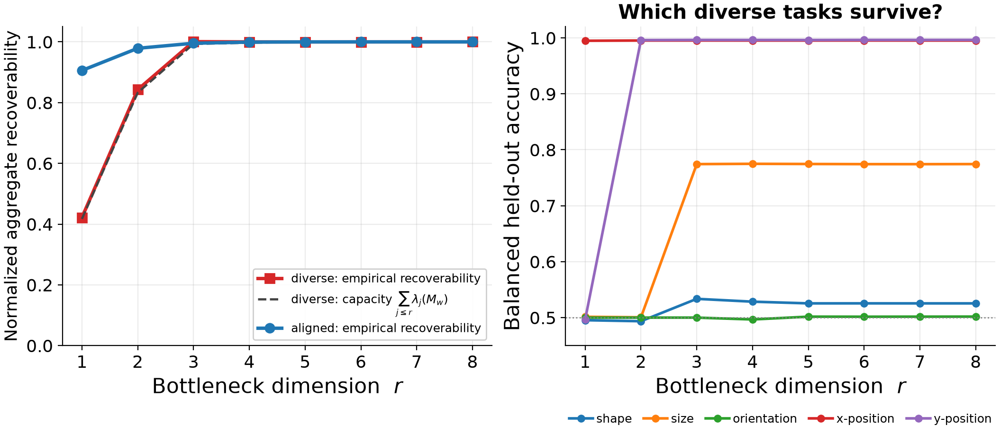
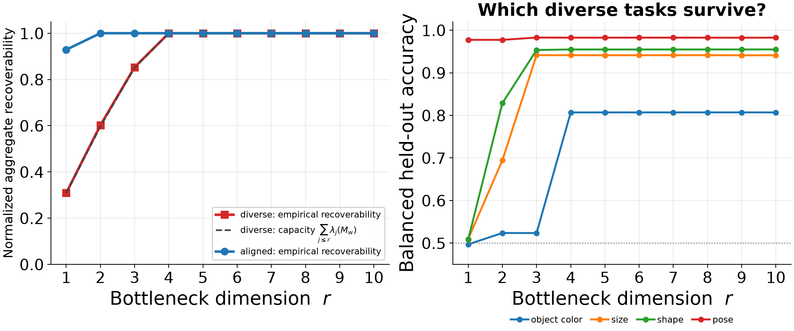
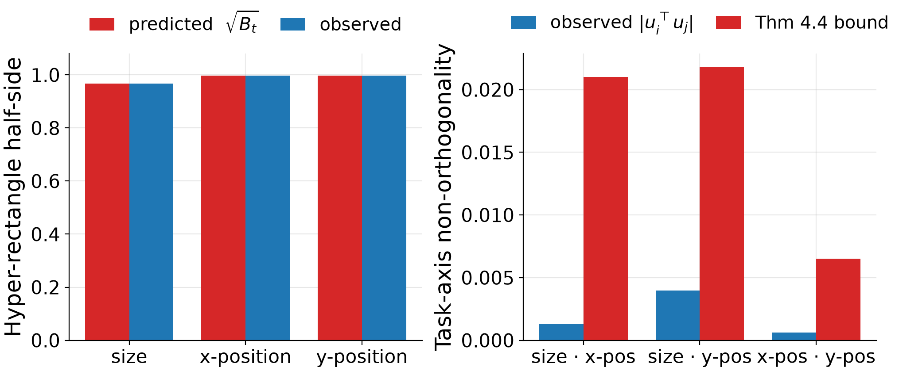
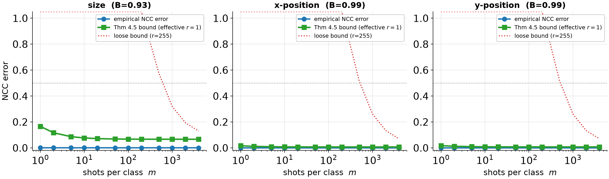

**One idea.** For a task, **B(F)** = how much of it is linearly readable from the
representation (R² of the best decoder). SSL keeps factors that are *stable across
views*; B measures how much of a task lives in that surviving subspace — and it
predicts the downstream geometry and transfer.

---

## 1 · Surviving factors form an orthogonal hyper-rectangle (RO1)

{width=52%}

VICReg / dSprites, no labels. The 8 granular-task centroids land on the corners of
an **axis-aligned box**: axes orthogonal (max|cos| = 0.004), side = √Bₜ.
*(Corner code: color = size, shape = x-pos, fill = y-pos.)*

---

## 2 · Holds across models and datasets

{width=82%}

Orthogonality is **architecture- and dataset-robust** (max|cos| ≤ 0.024 everywhere).
*Which* factor survives varies — that variation is the "which tasks survive" point.
3DShapes cube (color / shape / size):

{width=48%}

---

## 3 · RO2 — task-family spectrum predicts interference

{width=58%}

Aligned tasks (one factor) share **one** direction; diverse tasks (many factors)
need many — so they interfere under a small bottleneck.

{width=92%}

**Downstream proof:** force all tasks through one shared r-dim bottleneck.
*Left:* empirical recoverability tracks the predicted capacity Σⱼ≤ᵣ λⱼ(M_w).
*Right:* each factor switches on at its own r; shape/orientation never decode
(SSL discarded them).

---

## 4 · A higher-dimensional family (4 factors)

{width=92%}

3DShapes encoder preserving **four distinct factors** (color / size / shape / pose).
The diverse family needs **4 dimensions**, and empirical recoverability rides right
on the capacity curve Σλ(M_w) — a Task 2.1 capacity figure.

---

## 5 · Theory checks (for the paper)

{width=80%}

Thm 4.4: predicted √Bₜ = observed side to 0.00%; both bounds hold.

{width=92%}

Thm 4.5: few-shot NCC error stays under the bound; tight in the effective rep.

*(Also: `dsprites_box_evolution.gif` — the box sharpening over training.)*

---

## Honest notes
- √Bₜ side-length is essentially algebra; the real content is **orthogonality + factorization**.
- dSprites / 3DShapes are **controlled sandboxes**; CelebA (~6–10% predicted-vs-observed) is the real-data check.
- Clean **dimension ceiling ≈ 4** here; MPI3D failed (small object in clutter → factors unreadable).
