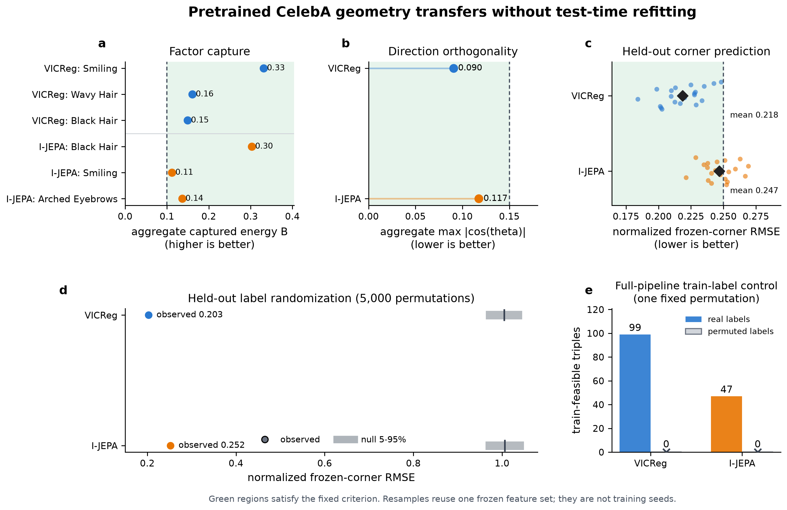
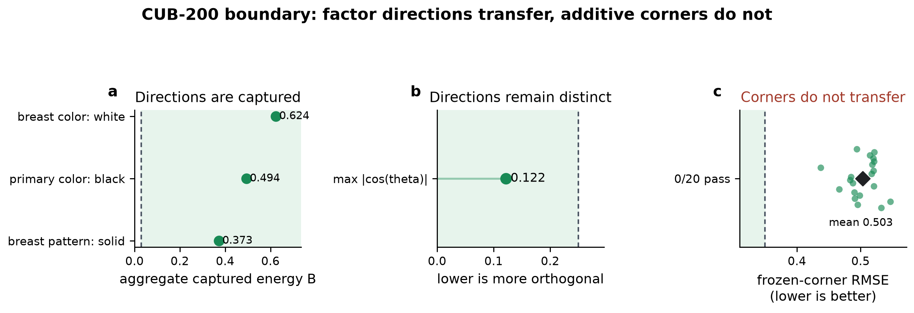
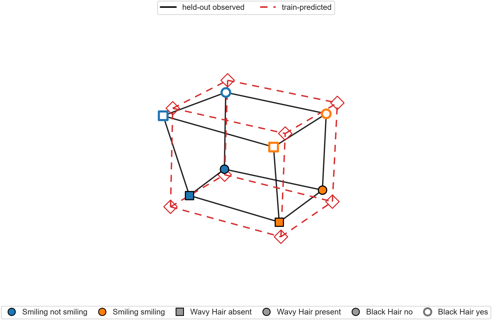
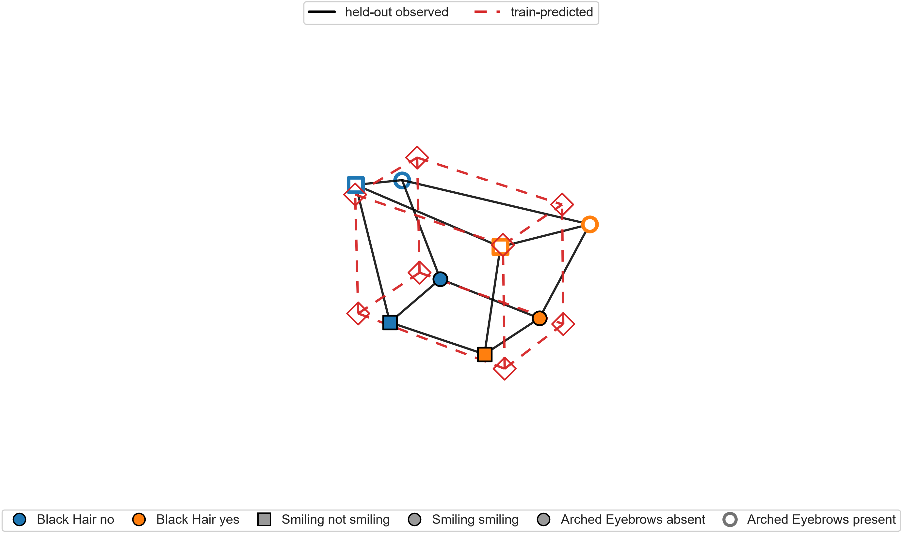
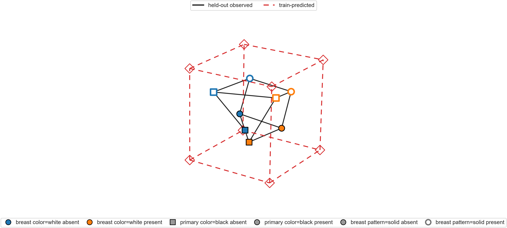

# Figure gallery

This page is the visual reading order. PDF versions sit beside each PNG.

## Main result: CelebA transfer

Read from left to right: all six selected factors are captured; the aggregate
directions meet the orthogonality target; frozen train-predicted corners remain
close on held-out resamples; observed errors are far below the conditional
label-permutation null; and the full train-selection pipeline finds no feasible
triple after label-column permutation.

## Supplement S1: CUB-200 boundary

CUB-200 separates directional structure from additive composition. The factors
are captured and distinct, but the frozen corners fail to transfer.

## Supplement S2-S4: observed and train-predicted boxes

### VICReg / CelebA

### I-JEPA / CelebA

### VICReg / CUB-200

Black edges are held-out centroids. Red dashed edges are corners predicted
entirely from the training split. The CUB discrepancy is the negative result,
not a rendering failure.

## Control-only plots

The standalone conditional-null histograms are retained under
[`controls/heldout_label_permutation/`](controls/heldout_label_permutation/).
They are already summarized in panel d of the main figure.
