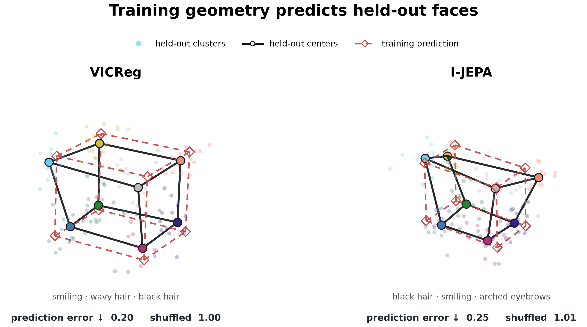
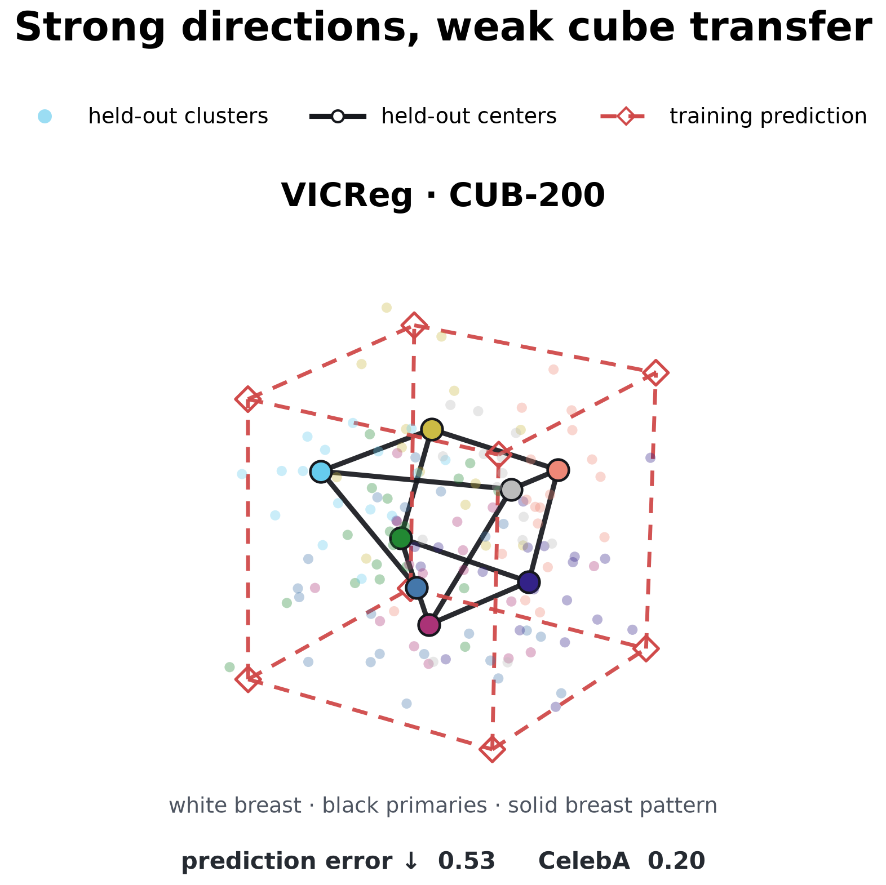
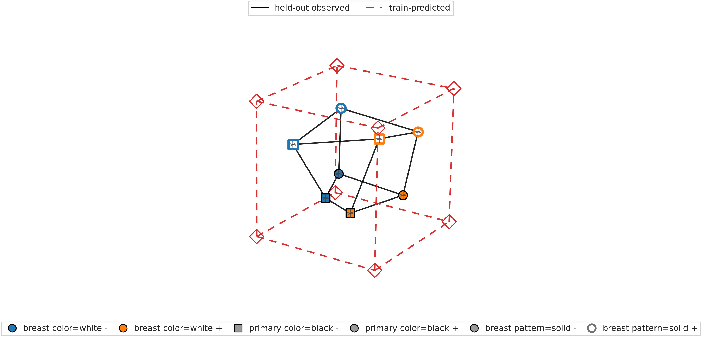

# Figure gallery

> **SUPERSEDED — DO NOT CITE OR SEND.** Both main figures visualize obsolete
> predicted corners. Corrected primary figures are in the
> [post-audit package](../pretrained_crossfit_postaudit_20260810/README.md).

## Figure 1: held-out CelebA cubes

Faint points show the eight held-out groups. The solid black cube joins their
centers; the red dashed cube was predicted from training images. Lower prediction
error is better, and shuffled held-out labels give approximately 1.0.
The displayed errors are 0.20 for VICReg and 0.24 for I-JEPA.

## Figure 2: CUB-200 boundary case

The held-out bird groups retain a structured box, but it is much smaller and
farther from the training prediction. This separates strong attribute directions
from accurate additive composition. Its error is 0.50, although its association
with the held-out labels remains far beyond the shuffled control (about 1.0).

Supplementary individual box views

### VICReg / CelebA

### I-JEPA / CelebA

### VICReg / CUB-200

Permutation details remain under
[`controls/heldout_label_permutation/`](controls/heldout_label_permutation/).
