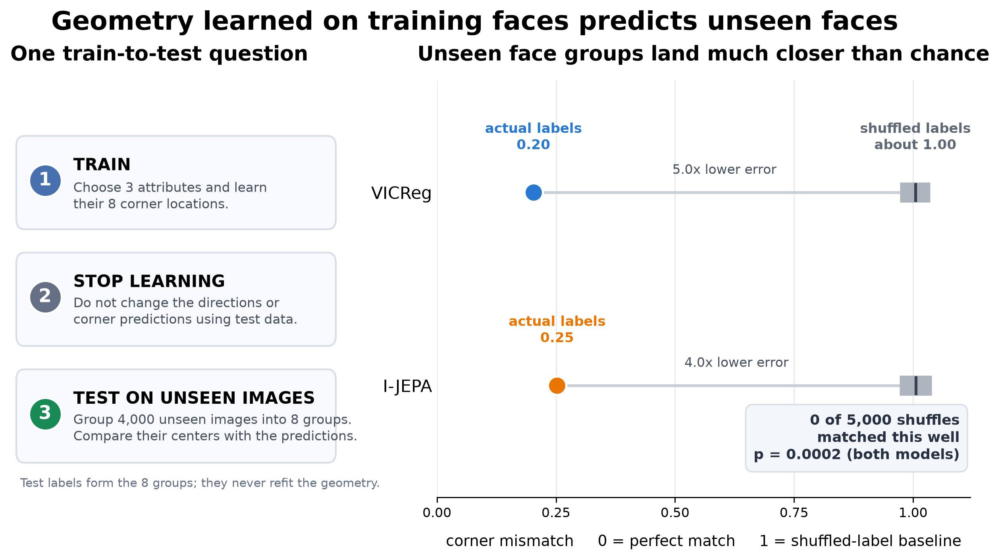
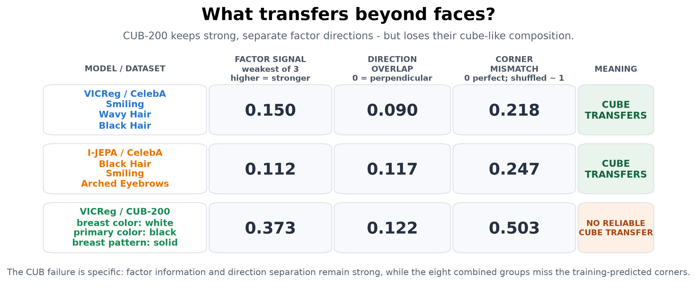

# Figure gallery

These first two figures are designed to be sent without additional explanation.
PDF versions sit beside each PNG.

## Figure 1: does training geometry predict unseen images?

Training images choose the three attributes and determine all eight predicted
corners. Learning then stops. On 4,000 unseen images, the eight actual group
centers have roughly four-to-five times lower error than when the same held-out
labels are shuffled. None of 5,000 shuffles matches either observed result.

## Figure 2: what part of the structure transfers?

CelebA has all three ingredients: factor signal, separate directions, and low
corner mismatch. CUB-200 retains the first two but has much worse corner
mismatch. This is the clean scientific distinction: finding useful factor
directions is not sufficient for cube-like additive composition.

Optional 3-D observed-versus-predicted boxes

These are supporting visualizations, not the primary explanation. Black edges
join held-out group centers; red dashed edges are predicted from training data.

### VICReg / CelebA

### I-JEPA / CelebA

### VICReg / CUB-200

The standalone permutation histograms remain under
[`controls/heldout_label_permutation/`](controls/heldout_label_permutation/).
They are summarized more directly in Figure 1.
